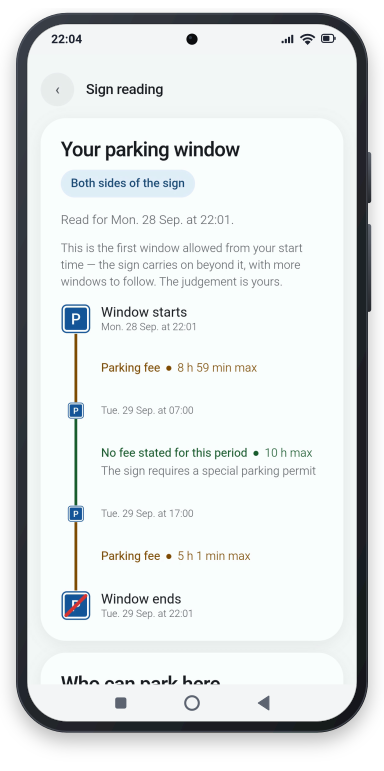
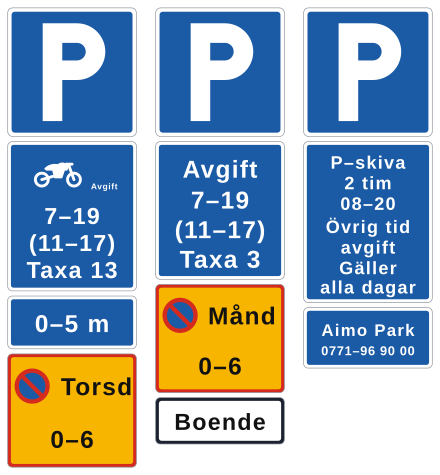
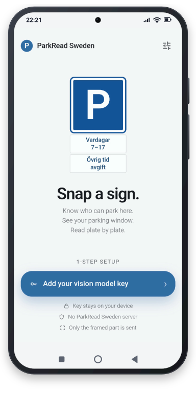
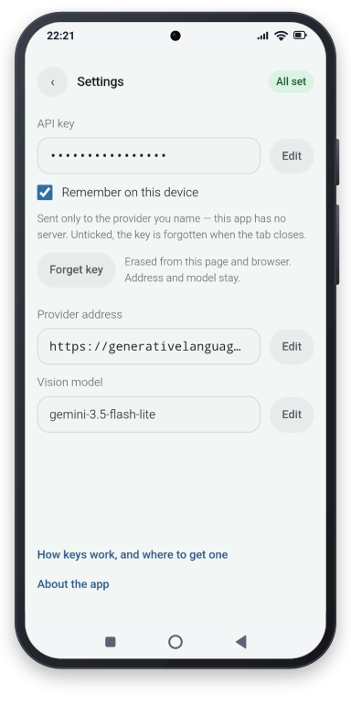
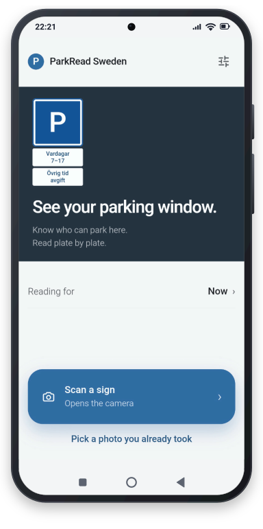
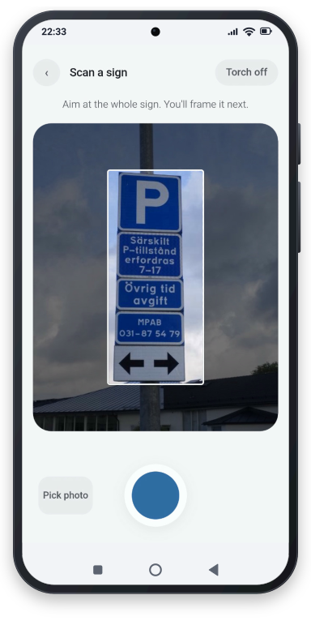
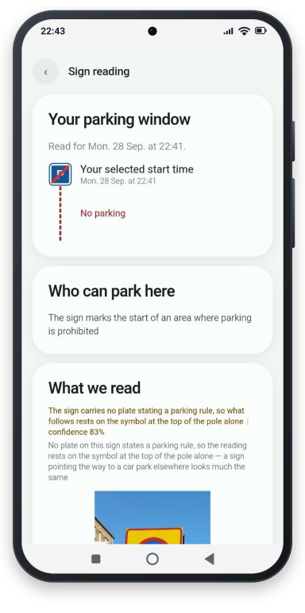

# ParkRead Sweden

**Take a photo of a Swedish parking sign and get a plain-English explanation of what it
says:** who may park, when, for how long, and whether you pay.



ParkRead Sweden **never says "you may park here"**. It tells you what the sign states, shows how
sure it is, and refuses to answer when the photo is not good enough. The decision stays
with you.

---

## The problem

In Sweden you may park on a street with no signs, for at most 24 hours in a row on
weekdays. Where there is a sign, it is rarely just a **P**. Under it hangs a stack of
small plates, and each one changes the rule: paid hours, a time limit, a parking disc, a
cleaning day, residents only, a permit, an arrow saying which part of the kerb is meant.



Reading such a stack correctly is hard, even for Swedes, and harder still for visitors
who do not read Swedish. A mistake costs a parking fine or a towed car. ParkRead Sweden reads the whole stack, applies the rules, and shows the result as a timeline.

---

## The solution

ParkRead Sweden splits the job in two and gives each half to what does it well: **an AI
model reads the sign, and the app's own code decides what it means.** An AI alone can
sound sure and be wrong; code alone cannot read a photo. Together, every step can be
checked.

1. **A quick check.** One cheap AI call answers a single question: is this a Swedish
   parking sign, another road sign, or not a sign at all? If it is not a parking sign, the
   app stops there and says what it sees.
2. **The AI reads the stack — and only reads.** A second call writes down what is on the
   sign: the main sign, every plate from top to bottom, its exact words, its colour,
   whether it could be read. It writes this in a fixed format and decides nothing.
3. **The code works out the rules.** It combines the plates, applies the Swedish calendar
   and public holidays, splits the sign by its arrows, and computes what applies at the
   time you chose. Given the same reading, it always gives the same answer. It also decides
   how sure that answer is — and whether to refuse rather than guess.
4. **You get it in plain English.** A built-in dictionary of Swedish parking signs and
   plates turns each plate into a plain explanation, shown next to your photo so you can
   compare.
   Wording the dictionary does not know is shown exactly as printed, marked "not
   interpreted", and never guessed at.

**What the sign leaves out.** Some rules apply without being on the sign — the 24-hour
limit, no parking near a junction or a crossing, and the like. ParkRead Sweden keeps
short notes about rules like these, shown behind a "show" link and clearly marked
"not on this sign". They never change the answer, with one exception: when a ban's hours
end and the sign says nothing more, the timeline follows the 24-hour limit, and says that
this part comes from the general rules, not from the sign.

---

## How to use it

ParkRead Sweden is a web page — no app store, no account. *(It is not published yet; the plan
is to host it on Cloudflare Pages.)*

1. **Open the page** in your phone's browser. You can add it to your home screen to use it
   like an app.
2. **Enter your AI key once** in **Settings** — see [Your key and your photo](#your-key-and-your-photo).
3. **Take a photo** of the sign, or choose one from your gallery.
4. **Pick the sign** in the photo. Only that part is sent to be read.
5. **Choose when you want to park** — now, or another day and time — and read the answer.

---

## What you see

- **Your parking window** — a timeline from the time you chose: when parking is free,
  paid or forbidden, and when your stay ends. A solid line means open to everyone and read
  in full; a dashed one means forbidden, not certain, or for some people only. Where
  arrows split the sign, each side gets its own timeline.
- **Who can park here** — everyone, residents, permit holders, rented spaces, and so on.
- **What we read** — your photo next to a copy of the sign, plate by plate, each with its
  Swedish text and a plain explanation. Plates that are not parking rules — an operator's
  name, a payment board — are labelled so, and nothing is silently left out.
- **How sure** — green: the whole sign was read; amber: an answer with a caveat; red: no
  answer.

Every sentence describes **the sign**, never you: "the sign allows 2 hours", not "you may
stay 2 hours".

### It refuses on purpose

When the photo does not support an answer, ParkRead Sweden says so instead of guessing: a plate
it cannot read, a main sign it cannot make out, a photo too small for the text on it, or
something that is not a parking sign at all. It still shows what it could read, says
what went wrong, and asks for another photo. A refusal is safer than a wrong answer that
looks right.

---

## Screenshots

<table>
<tr>
<td align="center" width="33%"></td>
<td align="center" width="33%"></td>
<td align="center" width="33%"></td>
</tr>
<tr>
<td align="center" width="33%"><b>First launch</b> — one step of setup</td>
<td align="center" width="33%"><b>Your own key</b> — your provider, your model</td>
<td align="center" width="33%"><b>Ready</b> — scan a sign, or pick a photo</td>
</tr>
<tr>
<td align="center" width="33%"></td>
<td align="center" width="33%"></td>
<td align="center" width="33%"></td>
</tr>
<tr>
<td align="center" width="33%"><b>Scan a sign</b> — aim at the whole sign</td>
<td align="center" width="33%"><b>Sign reading</b> — your parking window, plate by plate</td>
<td align="center" width="33%"><b>No parking</b> — a zone sign, and the plates that are not rules</td>
</tr>
</table>

---

## Your key and your photo

**You bring your own key.** ParkRead Sweden has no server and no account. In **Settings** you
enter your AI provider's address, the model name and your key. Without them the app opens
and explains itself, but cannot read a sign. Each sign costs two AI calls, billed to you
by your provider. The key is kept only while the tab is open, unless you tick **Remember
on this device**; **Forget key** erases it at once.

**Your photo goes to your provider and nowhere else.** Only the part around the sign is
sent. There is no server of ours and no history: nothing is stored except the app itself
and your saved key.

**Offline**, the app opens, but reading a sign needs the internet — and it says so rather
than failing quietly. Updates arrive the next time you open it online.

**Uninstalling:** remove the icon *and* clear the site data for the address — on Android
in the browser's site settings, on iPhone with **Remove App**, which takes its data with it.

**The parking decision is yours.** ParkRead Sweden reads a sign and tells you what it states. It
is a reading aid, not permission and not advice. Check the sign yourself before relying
on it.

---

## How well the app works

We keep a set of 139 test photos, 127 of them real parking signs with answers checked by
hand. On the latest run, **the app's answer matched the checked answer on 116 of the 127**.
Of the 11 it got wrong, 9 were marked as uncertain, so the reader was warned. Signs that
nobody could read were refused, as they should be, and no real sign was mistaken for
something else.

The photos themselves are not published — some are Street View images, and some show
number plates. The checked answers and the AI's saved readings are in `testset/`.

---

## Under the hood

The small things that took the most work:

- **Any day, any time.** Choose when you will park — now, tonight, or a Saturday next month
  — and the whole answer is worked out for that moment, not just for now.
- **The Swedish calendar, built in.** Every public holiday is computed from the law itself,
  Easter and Midsummer included, and so are the days before a holiday that bracketed hours
  such as `(8-15)` refer to. The timeline names them: *Red day: Midsommardagen (Midsummer
  Day)*, *Eve of Juldagen (Christmas Day)*.
- **Clock changes counted.** On the night the clocks go forward or back, a stay is measured
  in real hours, not in the numbers on the dial.
- **Not a parking sign? It stops.** A separate first check looks at the photo before
  anything is read. A shop front, a speed limit or a street name is turned away, with what
  was seen instead.
- **Rides out a busy AI.** When the provider is overloaded, the app tries again — up to six
  attempts within a minute, counting down each wait — and can be cancelled. If it still
  fails, you get one plain sentence saying why, not an error code.
- **Asks twice when it read too little.** An AI sometimes skims. If too little came back,
  the sign is read once more and the better reading is kept.
- **Checks the AI's homework.** Every reading is checked against a fixed format, and known
  slips are corrected in code — a yellow plate with hours under a **P** is a ban window,
  even when the AI forgets to say so. A reading that needed fixing shows a lower
  confidence.
- **When unsure, it is strict.** If a plate it could not read might be a ban, no stretch of
  time is shown as allowed.
- **Too few pixels, no answer.** A photo too small to hold readable text is refused, even
  when the AI returns fluent Swedish from it.
- **Finds the sign for you.** On a photo from your gallery, the frame lands on the sign by
  itself — found on your phone, and tuned against test photos marked by hand.
- **Your location stays home.** The part that is sent is redrawn first, which drops the
  photo's GPS position, time and phone model.

---

## Known limits

- **Sweden only.** A foreign sign would still be read by Swedish rules.
- **One sign per photo.** If two sign posts are in the photo, only one is read.
- **Dates 2026–2030.** The holiday calendar covers these years; other dates cannot be
  chosen.
- **Date parking** (no parking on odd or even dates) — the app cannot yet tell which dates,
  so it treats the ban as applying every day: stricter than the sign.
- **Residents' parking** is shown but not computed: residents' terms are agreed locally
  and differ from building to building.
- **Local wording.** Municipalities write their own plate texts. Unknown wording is shown
  as printed and lowers how sure the app is.
- **No conversation.** One photo, one answer — no chat, no follow-up questions.
- **iPhone is untested.** Installing and the camera should work in Safari; that is not a
  claim that they do.

---

## Running it yourself

You need Node 20 or newer. There is no server: the whole app runs in the browser.

```powershell
cd web
npm ci                 # install
npm run dev            # start it locally (https, so the camera works)
npm run dev:lan        # the same, reachable from a phone on your Wi-Fi
npm run build          # build it into web/dist
npm run preview        # see the built version
```

With `npm run dev:lan`, open the "Network" address it prints on a phone on the same
Wi-Fi. The browser warns once about the certificate; the camera needs https. Avoid this
on public Wi-Fi: the page is visible to the whole network while it runs.

To publish, copy `web/dist` to any static host, such as Cloudflare Pages. It works from
the root of a domain or from a subfolder.

### Commands for development

| Command | What it does | When to use it |
|---|---|---|
| `npm test` | runs all the automated tests | after any change |
| `npm run test:build` | builds the app and checks the result | before publishing |
| `npm run emit` | copies the sign dictionary, the data format and the AI instructions into the app | after editing anything in `reference/`, `schema/` or `prompts/` |
| `npm run goldens` | checks the saved snapshots of the app's output (in `parity/`) | after a code change; `npm run goldens:write` updates them when a change is intended — then review the difference |
| `npm run measure` | scores the app on the test photos | after changing how signs are read or judged |
| `npm run ask` | asks the AI again about test photos, and saves its answers | when the AI instructions change — costs money, needs your key in `.env` and the photos |
| `npm run photos` | updates the list of test photos | after adding or renaming a test photo |
| `npm run detect` | scores where the app places the frame on the test photos, against the boxes marked on `/mark.html` (open it on `localhost` while `npm run dev` runs) | after changing how the app finds a sign in a photo — needs the photos |

`npm run ask` is the only command that uses `.env` — see `.env.example` for its three
fields. Any provider that speaks the OpenAI-compatible format works (Google, Mistral,
OpenRouter); ParkRead Sweden was developed with Google's `gemini-3.5-flash-lite`.

---

## Stack and layout

TypeScript · React 19 · Vite · Tailwind · Vitest · JSON Schema · an external AI model
reached with the reader's own key. No backend, no database, no secrets in the build.

```
web/
  src/
    App.tsx          the screen and its state
    components/      one component per part of the screen
    lib/
      pipeline.ts      the steps above, in order
      vision.ts        the two AI calls
      validation.ts    checks and fixes the AI's answer
      engine.ts        the rules: works out what applies when — no AI, no clock
      calendar.ts      weekdays, Saturdays, Sundays and public holidays
      completeness.ts  how complete the reading is, and how sure the answer
      present.ts       the answer in the words the reader sees
      reference.ts     the sign dictionary
      settings.ts      your key and provider, kept in the browser
    sw.ts            works offline
  tools/           the development commands above
reference/       the sign dictionary and the general-rules notes, one plain-text file each
schema/          the exact format the AI must answer in
prompts/         the instructions given to the AI
testset/         the test photos' checked answers and the AI's saved readings
parity/          saved snapshots of the app's output, for the tests
images/          the pictures in this README
```

The rules never depend on the screen, and the screen never depends on the AI provider.
`AGENT_SPEC.md` describes what the AI is allowed to do inside the app, and `design.md`
how the screens are built.

---

## Disclaimer

ParkRead Sweden is a personal, experimental project, built in spare time by one person — a
product person, not a programmer — entirely with AI tools.

It is not a professional product. There is no company, no team and no support behind it,
and nothing is guaranteed: readings can be wrong, and the app can change or stop working
at any time. It has no connection to any authority, municipality or parking company; the
operator names in the pictures appear only because they are printed on the signs.

**You use it at your own risk.** ParkRead Sweden is a reading aid, not permission and not
advice: what it shows is all there is, and the decision to park is yours. Check the sign
before relying on it.

---

## License

MIT License

Copyright (c) 2026 Petr Agulin

Permission is hereby granted, free of charge, to any person obtaining a copy of this
software and associated documentation files (the "Software"), to deal in the Software
without restriction, including without limitation the rights to use, copy, modify, merge,
publish, distribute, sublicense, and/or sell copies of the Software, and to permit persons
to whom the Software is furnished to do so, subject to the following conditions:

The above copyright notice and this permission notice shall be included in all copies or
substantial portions of the Software.

THE SOFTWARE IS PROVIDED "AS IS", WITHOUT WARRANTY OF ANY KIND, EXPRESS OR IMPLIED,
INCLUDING BUT NOT LIMITED TO THE WARRANTIES OF MERCHANTABILITY, FITNESS FOR A PARTICULAR
PURPOSE AND NONINFRINGEMENT. IN NO EVENT SHALL THE AUTHORS OR COPYRIGHT HOLDERS BE LIABLE
FOR ANY CLAIM, DAMAGES OR OTHER LIABILITY, WHETHER IN AN ACTION OF CONTRACT, TORT OR
OTHERWISE, ARISING FROM, OUT OF OR IN CONNECTION WITH THE SOFTWARE OR THE USE OR OTHER
DEALINGS IN THE SOFTWARE.
